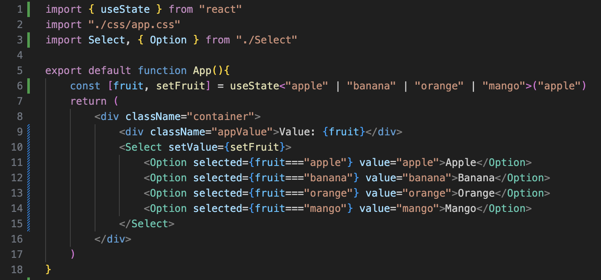

# Task: Select

## Technical specification
You need to develop a Select component and design it as in the [Figma layout](https://www.figma.com/design/3glzmEno92oZA2f9RupSfF/Untitled?node-id=0-1&p=f&t=UqtMz5YPgMUZJNTh-0).
The following behavior should be implemented:
- When the user clicks on the select field, the select menu opens. If the menu was opened at the time of clicking on the field, then it closes (toggle)
- When the user clicks on any place on the page that does not belong to this selection, the menu closes if it was open
- When the user clicks on an Option in the select menu, the value of this Select changes to the value of the Option that was clicked, and the menu closes
- In Options, you don't need to use icons like in a Figma, just text options: "Option 1", "Option 2", "OPtion 3", ...

## Note
- After copying the repository, run command `npm i` to install all necessary dependencies
- To start the project, use the `npm start` command. Then open it in the browser `localhost:61005`
- To add an svg icon, create a file in the `src/icons` folder, for example `icon.svg`, copy the icon from Figma to svg and paste it into this file. In the inserted svg, delete all the `fill`, `width`, `height` attributes so that they can be changed later via css. If the copied svg uses the stroke attribute instead of fill, then in Figma, before copying, you need to apply "Flatten" and "Outline stroke" to the icon. To use this icon in the code, use import: `import { ReactComponent as IconSvg } from "./icons/icon.svg"`

## Implementation example

## Example of App.tsx
